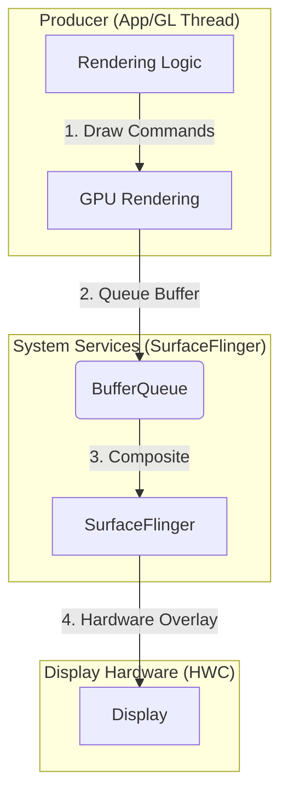
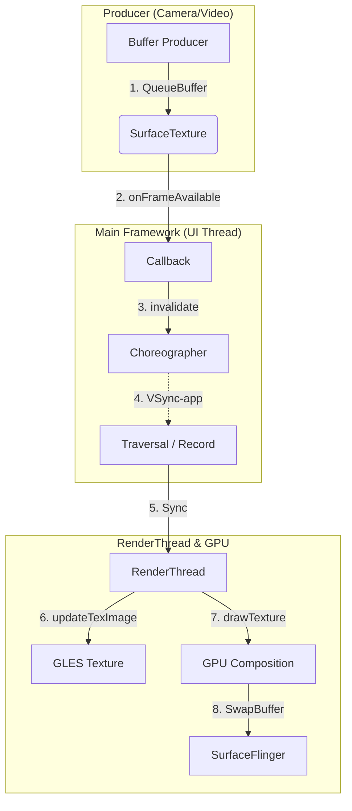

# Android 渲染链路深度分析：SurfaceView 与 TextureView

在现代 Android 硬件加速架构下，理解 `SurfaceView` 和 `TextureView` 的底层差异对于优化高性能 UI 至关重要。

## 1. 第一性原理：设计初衷与核心本质

Android 的 UI 渲染本质上是**资源的争夺与协调**。

*   **时效性 (Latency)**：对于视频流或游戏，每一毫秒的延迟都直接影响体验。
*   **能耗 (Power)**：频繁的 GPU 拷贝和多余的合成步骤会增加功耗。
*   **硬件限制 (Hardware Constraints)**：移动端 GPU 频宽有限，必须尽可能减少离屏渲染。

---

## 2. 名称背后的哲学：Surface vs Texture

您提到的“名称”差异，揭示了 Android 架构设计中对**消费者（Consumer）**身份的定义：

### 2.1 为什么叫 SurfaceView？
*   **本质：独立的“窗体”**。在 Android 源码中，`Surface` 代表了一个 BufferQueue 的生产者端。对于 `SurfaceView` 而言，它直接向 `SurfaceFlinger` 申请了一个独立的图层。
*   **消费方式：合成（Composition）**。`SurfaceFlinger` 并不关心这个 Buffer 里的像素具体长什么样，它只负责把这个“平面（Surface）”通过硬件（HWC）叠在主窗口层级中。
*   **形象比喻**：它像是一张**贴在窗户外的海报**。它有自己的纸张（Surface），虽然被窗框（View 树位置）限制，但它是一个完完整整的物理存在。

### 2.2 为什么叫 TextureView？
*   **本质：内部的“素材”**。它不申请独立图层，而是将内容注入到一个 `SurfaceTexture` 中。
*   **消费方式：采样（Sampling/Drawing）**。对于主线程的 `RenderThread` 来说，`TextureView` 的 Buffer 仅仅是一张 **纹理（Texture）**——也就是一堆像素材。它必须通过 GL 的 `drawTexture` 命令，把这堆素材“画”在主窗口的 Canvas 上。
*   **形象比喻**：它像是一张**投影在墙上的幻灯片**。它没有自己的纸张，它的像素最终必须和墙面（主 UI）的像素混合在一起，成为主 UI Buffer 的一部分。

### 2.3 “高配版”还是“牺牲品”？
*   从**性能**上看，`SurfaceView` 确实是“高配”：它独占 Buffer，且支持 Hardware Overlay，性能损耗接近于零。
*   从**融合度**上看，`TextureView` 才是“高配”：因为它是一张投影，所以你可以给这张投影加滤镜、旋转 3D 角度、甚至设置 50% 的透明度。而 `SurfaceView` 由于是物理贴图，很难完美地与主 UI 的其他 View 进行复杂的 Z-轴交织。

### 2.4 数据本质：Buffer 还是 Texture？
在 Producer（生产者）的角度，**两者产出的“成品”是一模一样的**。

- **相同的起点**：无论你用哪个，Producer 拿到的都是一个 `Surface`。你往里面画东西，最终产出的都是一个名为 **`GraphicBuffer`** 的内存块。
- **不同的归宿（Consumer 分野）**：
    - **SurfaceView**：这个 Buffer 被送到了 **SurfaceFlinger**。在系统眼中，这个 Buffer 是一个 **Layer（图层）**。它已经是一个“成品”了，系统只需要决定把它摆在屏幕的哪个位置。
    - **TextureView**：这个 Buffer 被送到了 **应用的 GL 线程**。在系统眼中，这个 Buffer 变成了一张 **Texture（纹理）**。它不是成品，而是“**原材料**”。主线程的 `RenderThread` 需要把它当作一张贴图，画在自己的 Canvas 上。

**结论**：之所以叫 TextureView，是因为在数据流的终点，这块内存被主渲染链路当成了 **Shader（着色器）中的采样源**；而 SurfaceView 直接把这块内存当成了**物理显示的平面**。

---

## 3. 渲染链路详解

### 3.1 SurfaceView 的“独立王国”
`SurfaceView` 通过私有的 **Sync BufferQueue** 与 `SurfaceFlinger` 通信。其核心在于通过 **Fence (信号量)** 实现硬件级的异步同步。

#### 核心机制：离屏与“挖洞” (Punch-Hole)
`SurfaceView` 的独立性使其渲染成果必须通过某种方式与主 UI 结合。这里涉及到一个巧妙的**透显机制**：

1.  **分层堆叠**：默认情况下，`SurfaceView` 的平面位于主窗口平面的 **下方** (Z-Order < 0)。
2.  **挖洞逻辑**：既然在下面，为什么能看见？因为 `SurfaceView` 在主视图树执行 `onDraw`时，会在其对应区域绘制 **完全透明的像素** (使用 `PorterDuff.Mode.CLEAR`)。
    *   **比喻**：主 UI 是一堵墙，`SurfaceView` 是墙后的海报。`onDraw` 的动作就是在墙上开个“窗户”，让 `SurfaceFlinger` 合成时能透出海报。

#### 同步困境：如果重绘时没画完会怎样？
由于主线程（开窗户）和渲染线程（画海报）是并发的，必然存在不同步的时刻。我们分三种场景来看：

*   **场景 A：初始化的“黑闪” (Black Flash)**
    *   **现象**：主线程响应 `VSYNC-app` 发现布局加载完成，立即“开窗”。但此时渲染线程还没给 BufferQueue 提交第一帧。
    -   **结果**：窗户开了，但后面是空的（无 Buffer 数据），用户会看到一个瞬时的黑块。
    -   **解决**：源码中 `performDrawFinished` 后调用 `invalidate`，就是为了确保**只有后台有货了，前台才去挖这个洞**。
*   **场景 B：运行中的“静态延迟” (Stale Frame)**
    *   **现象**：由于用户操作触发布局重绘，主线程刷新了透显区域，而渲染线程正忙于计算新帧尚未提交。
    -   **结果**：主 UI 更新了，但 `SurfaceFlinger` 依然持有 `SurfaceView` 的**上一个有效 Buffer**。
    -   **表现**：画面内容表现出 1-2 帧的微弱落后，产生轻微的滞后感。
*   **场景 C：缩放动画中的不同步 (Scaling Artifacts)**
    *   **现象**：View 正在缩放，“窗户”位置和大小随之剧烈变动，而渲染线程的产出频率或分辨率调整跟不上。
    -   **结果**：窗户和海报的边缘对不上。
    -   **解决**：Android 10+ 通过 `SurfaceControl.Transaction` 机制强制让主窗口位置更新与 Buffer 提交进行**原子级绑定**，从底层解决了动画中的拉伸和黑边问题。

### 3.2 TextureView 的“集成之路”
`TextureView` 的核心在于 `SurfaceTexture`。它将 Producer 生产的 Buffer 转换为主渲染链路可以理解的 GLES 纹理。其驱动机制是一种“**被动触发，同步拉取**”的模式。

-   **驱动逻辑**：
    1.  **使用者控制生产**：生产者（如解码器）决定什么时候产生 Buffer，这部分是自主的。
    2.  **系统控制上屏**：一旦 Buffer 到达，`TextureView` 会监听 `onFrameAvailable` 并调用 `invalidate()`。
    3.  **VSync 决定合成**：真正的“上屏”操作必须等待 **`VSYNC-app`** 信号。只有 VSync 到达后，主线程才开始 Traversal，`RenderThread` 才会执行 `updateTexImage` 从 `SurfaceTexture` 中把 Buffer “拉”出来并绘制到 UI 的 Buffer 中。
-   **结论**：即使生产者每秒产出 120 帧，如果主线程因为卡顿没响应 `VSYNC-app`（例如 `Traversal` 没跑），`TextureView` 屏幕上的画面就不会更新。

---

## 4. 深度追踪：SurfaceView 与 BufferQueue 背压

您的观察非常精准。为了精准描述资源浪费与阻塞，我们需要理解 `BufferQueue` 的四种状态：

### 4.1 Buffer 的四种法定时态
1.  **FREE (空闲)**：Consumer 已释放，Producer 可通过 `dequeueBuffer` 获取。
2.  **DEQUEUED (生产者锁定)**：Producer 正在绘制（或 GPU 正在绘制，由 Fence 守护）。
3.  **QUEUED (入队等待)**：绘制完成，已提交给 Queue，等待 Consumer (SF) 来 `acquire`。
4.  **ACQUIRED (消费者锁定)**：正在被 `SurfaceFlinger` 合成或正在被 HWC 扫描输出到屏幕。

### 4.2 为什么 SurfaceView 会“挂起”？
在典型的 **Triple Buffering (三缓冲)** 环境下：
- **Buffer A (ACQUIRED)**：正在屏幕上显示。
- **Buffer B (QUEUED)**：上一帧渲染完，在队列里排队，等待下次 VSync 合成。
- **Buffer C (DEQUEUED)**：渲染线程（SurfaceView）正在画这一帧。

由于 `SurfaceView` **不受 VSYNC-app 限制**，它可以立即绘制并 `queue` Buffer C。此时，队列中有 2 个 Buffer (B, C) 在排队，而屏幕占用 1 个 (A)。
**结果**：此时 `BufferQueue` 已无 **FREE** 状态的 Buffer。当你的渲染线程猴急地发起下一次 `dequeueBuffer` 时，它就会被**物理挂起**，直到 `VSYNC-sf` 到来释放 Buffer A。

### 4.3 资源浪费：无意义帧的丢弃
正如您所说，如果 RenderThread 太快：
- 它会迅速填满队列（B 和 C 都变为 QUEUED）。
- `SurfaceFlinger` 在下次刷新时，如果设置了 `max_acquired_buffers=1` 且它是 Layer 模式，它可能会直接跳过 B 去获取 C。
- **后果**：Buffer B 还没能上屏就被丢回 FREE 列表了。这造成了无效的 CPU/GPU 渲染功耗。

---

## 5. Input 系统与交互时延

两者在响应用户“输入事件”（如触摸）时，在分发链路上有共同点，但在**反馈时延**上表现迥异。

### 5.1 分发链：殊途同归
由于 `SurfaceView` 和 `TextureView` 都是 `android.view.View` 的子类，Input 系统的分发路径对它们是**一致的**：
1.  **系统层**：`InputDispatcher` 通过 Socket 将原始 `MotionEvent` 发送到应用的 `WindowInputStream`。
2.  **UI 线程**：`ViewRootImpl` 接收事件，并从顶层 `DecorView` 开始向下分发。
3.  **最终落地**：事件在 **主线程 (UI Thread)** 回调两者的 `onTouchEvent`。

### 5.2 反馈链：渐行渐远
真正的性能差距在于“从按下到画面变化”的**交互感知时延**：

-   **TextureView (串行反馈)**：
    -   逻辑：UI 线程收到 Touch -> 修改状态 -> 调用 `invalidate()` -> 等待下一个 `VSYNC-app` -> `onDraw` -> `RenderThread` 绘制生成 Buffer。
    -   **缺陷**：如果主线程正忙于布局计算或正在滑动 RecyclerView，你的触摸反馈（比如拖动滑块）会被卡在 UI 线程的 Task 队列里，产生明显的滑动不跟手。
-   **SurfaceView (并行反馈)**：
    -   逻辑：UI 线程收到 Touch -> 立即将坐标通过队列传给 **独立渲染线程** -> 渲染线程立即出帧 -> 直接提交并上屏。
    -   **优势**：反馈链路绕过了主线程的整个渲染流水线。即使 UI 界面卡得不动，`SurfaceView` 内部的内容依然能根据最新的触摸坐标进行流畅反馈。

---

## 5. 性能监测：如何定位 Jank 根源？

理解了原理后，我们需要通过工具验证。在 `Systrace` 或 `Perfetto` 中，您可以观察到明显的特征差异：

### 5.1 定位 TextureView 的 Jank
- **特征**：在 `RenderThread` 的 trace 中，您会看到 `drawTexture` 或 `nsecs_t` 耗时显著增加。
- **排查点**：
    - 检查主线程是否在 `onMeasure/onLayout` 耗时过长。
    - 观察是否有 `SurfaceTexture.updateTexImage` 的调用，如果 RT 在此处等待，说明 Producer 生产 Buffer 太慢。
    - 如果 RT 的 `queueBuffer` 之后有长段的空白，说明 GPU 负载过重，正在处理复杂的采样算法。

### 5.2 定位 SurfaceView 的 Jank
- **特征**：主线程和 `RenderThread` 可能都很悠闲，但画面依然卡顿。此时应观察 **自定义生产者线程**。
- **排查点**：
    - 寻找 `dequeueBuffer` 的 trace。如果该调用持续时间接近 16ms，说明它陷入了上述的 **Backpressure 阻塞**，即消费端（SF/HWC）还没空出位置。
    - 检查渲染线程的逻辑。如果它在没有 `VSYNC` 保护的情况下跑，可能会看到大量 Buffer 被丢弃。

---

## 6. 最终总结与建议

在确定使用哪种方案时，请参考以下决策矩阵：

| 决策维度 | SurfaceView (推荐) | TextureView (慎选) |
| :--- | :--- | :--- |
| **主要用途** | 视频、游戏、相机、地图 | 简单的视频装饰、复杂的 UI 动画叠加 |
| **性能极限** | 4K 60FPS / 120Hz 极稳 | 1080P 以上容易因为 UI 抖动而掉帧 |
| **层级关系** | 只能在主 UI 之上或之下 | 可以与各种 View 完美穿插、半透明 |
| **开发难度** | 高（需自理线程、生命周期及 VSync 步进） | 低（API 友好，像操作普通 View） |

### 核心忠告：
- **如果你在写播放器或地图引擎**：请务必使用 `SurfaceView`。它对 `VSYNC-app` 的解耦保证了即使你的 App 正在进行繁重的 JSON 解析或 UI 刷新，画面依然能如丝般顺滑。
- **如果你发现 App 有 Jank**：请第一时间打开 `Perfetto` 观察 `RenderThread` 是否被 `TextureView` 的纹理更新占满。如果是，尝试迁移到 `SurfaceView` 往往能起到立竿见影的“减负”效果。

---
*分析完成。希望这份深度报告能帮助您在复杂的 Android 图形开发中做出最理性的架构决策。*
