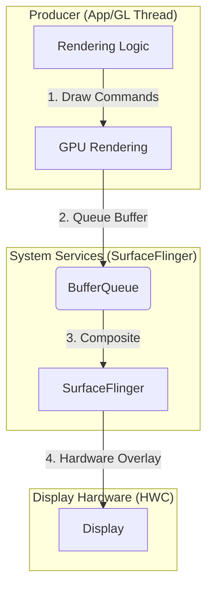
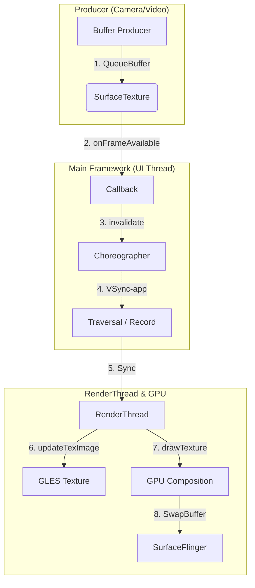

# Android 渲染链路深度分析：SurfaceView 与 TextureView

在现代 Android 硬件加速架构下，理解 `SurfaceView` 和 `TextureView` 的底层差异对于优化高性能 UI 至关重要。本篇报告采用**问题驱动**的方式，对两者的架构本质进行深度拆解。

---

## 1. 第一性原理：Android 为什么要设计这两套机制？

> **问题引引子**：现代 Android 硬件加速下，`RenderThread` 负责将 Canvas 操作转换为 GPU 指令。既然已经有了成熟的 View 树渲染体系，为什么还要引入 `SurfaceView` 和 `TextureView`？它们的高频刷新会拖累主 UI 导致 Jank 吗？

Android 的 UI 渲染本质上是**资源的争夺与协调**。引入这两者的核心目标是为了解决以下痛点：
*   **时效性 (Latency)**：对于视频流或游戏，每一毫秒的延迟都直接影响体验。
*   **能耗 (Power)**：频繁的 GPU 拷贝和多余的合成步骤会增加功耗。
*   **并发需求**：主 UI 树的测量、布局、绘制都在主线程，无法承载高频率且耗时的复杂渲染任务（如 60FPS 的游戏）。

---

## 2. 名称背后的哲学：Surface vs Texture

> **问题引子**：为什么一个叫 SurfaceView 另一个叫 TextureView？它们产出的“成品”是一样的吗？是否存在“高配版”之说？

### 2.1 生产者视角的“成品”
在 Producer（生产者）的角度，**两者产出的“成品”是一模一样的**。
无论你用哪个，Producer 拿到的都是一个 `Surface`。你往里面画东西，最终产出的都是一个名为 **`GraphicBuffer`** 的内存块。

### 2.2 消费者视角的“归宿”
两者的本质区别在于这块 `GraphicBuffer` 被谁消费，以及如何消费：

*   **SurfaceView（独立的“窗体”）**：
    *   **本质**：它对应的是一个独立的 Surface/layer 链路。在 Android 10 语境下，适合从 `SurfaceControl` 和独立 layer 去理解；在后续版本中，这条链路又进一步与 BLAST/Transaction 体系结合。
    *   **消费方式**：`SurfaceFlinger` 把它当成一个完整的**物理平面**进行合成。
    *   **比喻**：贴在窗户外的海报。它有自己的载体。

*   **TextureView（内部的“材质”）**：
    *   **本质**：它将内容注入到一个 `SurfaceTexture` 中。
    *   **消费方式**：应用自己的 `RenderThread` 把它当成一张 **纹理（Texture）** 进行采样。
    *   **比喻**：投影在墙上的幻灯片。它必须寄生在主 UI 的 Buffer 中。

### 2.3 性能与灵活性对比
*   **SurfaceView** 是性能上的“高配”：直达系统合成，支持硬件叠加（Hardware Overlay），损耗极低。
*   **TextureView** 是交互上的“高配”：因为它本质是纹理，所以可以进行 3D 变换、滤镜处理、设置透明度，与普通 View 完美融合。

---

## 3. 渲染链路深度拆解

> **问题引子**：SurfaceView 和 TextureView 的渲染链路有什么不同？TextureView 是靠什么更新帧的？

### 3.1 SurfaceView 的“独立王国”
`SurfaceView` 实现了画面流与主 UI 流的并发。

#### 核心机制：透显与同步 (Punch-Hole)
*   **历史理解入口：挖洞逻辑**。很多 Android 10 及更早期的分析会用“Punch-Hole”解释 `SurfaceView`：主视图树在对应区域做透明透显，从而露出后面的独立 surface 内容。这个比喻很有帮助，但它更适合作为**历史与直觉上的理解入口**。
*   **现代主线理解**：今天更稳妥的理解应该是：
    *   `SurfaceView` 的内容本来就是独立 layer
    *   View 树负责它的布局占位
    *   `SurfaceControl.Transaction` 以及后续 BLAST 一类机制负责让几何变化、buffer 提交和 layer 状态更稳定地同步
*   **invalidate 的迷思**：既然内容直达 SF，为什么源码中 `performDrawFinished` 还要调用 `invalidate`？
    *   这是为了解决“**初始黑闪**”：主线程只有在确认后台第一帧已经画好后（`performDrawFinished`），才敢去执行 `invalidate` 将“窗户”挖开。
*   **未画完会怎样？**
    *   **场景 1 (初始状态)**：主线程先挖洞但后台没 Buffer，用户会看到瞬时黑块（黑闪）。
    *   **场景 2 (运行中)**：主线程重绘但后台没新帧，此时透显的依然是上一帧 Buffer，导致画面轻微滞后。

### 3.2 TextureView 的“集成之路”
`TextureView` 的驱动机制是“**被动触发，同步拉取**”。

*   **帧更新驱动**：靠的是 **`VSYNC-app`** 信号。
*   **逻辑闭环**：生产者产生 Buffer -> 触发 `onFrameAvailable` -> 调用 `invalidate()` -> 等待系统 VSync -> 主线程重绘 -> `RenderThread` 执行 `updateTexImage` 拉取纹理并绘制。
*   **后果**：如果主线程卡顿，即使生产者产出再猛，屏幕画面也无法更新。

这里最值得记住的一句话是：

- `SurfaceView` 更像“独立图层最后再汇合”
- `TextureView` 更像“先变成纹理，再并入应用自己的 UI 绘制”

---

## 4. 资源限制：Buffer 什么时候会被锁死？

> **问题引子**：SurfaceView 不受 VSync 限制，是否会导致其在 16ms 内产出多帧而浪费资源？三个 Buffer 最多会有几个使用者？

### 4.1 BufferQueue 的四种状态
1.  **FREE**：可被生产者申请。
2.  **DEQUEUED**：正在被生产者绘制。
3.  **QUEUED**：绘制完成在排队，等消费者获取。
4.  **ACQUIRED**：正在被显示/合成。

### 4.2 锁死场景分析
在典型的三缓冲下，Buffer 最多有两个使用者：**Producer (App)** 和 **Consumer (SF/HWC)**。
*   **由于不受 VSync 限制**，SurfaceView 的生产者可能在一次显示刷新周期内迅速画完两帧，导致队列中有 2 个 Buffer（QUEUED），屏幕占用 1 个（ACQUIRED）。
*   此时 `BufferQueue` 已经没有 FREE 状态的 Buffer。当生产者试图申请下一块时，就会被**物理挂起**，产生“背压”，直到下次显示器刷新释放出旧 Buffer。
*   **资源浪费**：如果生产速度远高于消费速度，中间产生的很多帧可能会失去显示价值，造成 CPU/GPU 的无效功耗。

这里要避免一个过于绝对的误解：

- 不能把它理解成“SurfaceFlinger 永远优先最新帧，旧帧一定会被主动跳过”
- 更稳妥的说法是：当 producer 速度显著高于显示节拍时，旧帧可能来不及被显示就失去意义，从而形成浪费

---

## 5. Input 系统：为什么 SurfaceView 更跟手？

> **问题引子**：两者都能响应触摸事件吗？对于主线程繁忙的场景，谁的表现更好？

### 5.1 分发链一致，反馈链分叉
*   **分发**：两者都是 `View`，事件分发都在主线程。
*   **反馈 (Latency)**：
    *   **TextureView (串行)**：反馈必须经过主线程任务队列和渲染线程。如果主线程在遍历复杂布局，你的拖动反馈就会明显滞后。
    *   **SurfaceView (并行)**：主线程收到 Touch 后可以直接丢给独立渲染线程。反馈链路绕过了主 UI 的繁重遍历，交互极其敏锐。

这里也要补一个边界：

- `SurfaceView` 并不等于“完全不影响应用 UI”
- 它仍然可能与主 UI 竞争 GPU、带宽和 SurfaceFlinger 合成资源
- 只是它通常不需要每一帧都重新走应用主窗口的 HWUI 绘制链，所以对 UI jank 的影响更偏“间接竞争”，而不是“直接并入本帧”

---

## 6. 现代实现补充：为什么今天还要把 Android 10 与 BLAST 放在一起看？

> **问题引子**：如果我主要读的是 Android 10 源码，结论会不会过时？

不会过时，但需要分清“主干原理”和“实现细节”。

### 6.1 没变的主干原理

下面这些结论到今天依然成立：

- `SurfaceView` 更接近独立 surface / 独立 layer
- `TextureView` 更接近把内容重新并入 app 自己的 UI 绘制链
- `SurfaceView` 更适合视频、相机、游戏、地图这类高频内容
- `TextureView` 更适合需要和普通 View 做动画、透明、变换融合的场景

### 6.2 变化的实现细节

更现代的 Android 在这几个地方做了加强：

- `SurfaceControl.Transaction` 对几何变化和内容更新的同步更重要
- Android 11+ 之后可以更多从 BLAST 的角度理解 buffer 与窗口状态的原子提交
- 所以早期资料里的“挖洞”“上下层透显”仍然有教学价值，但今天分析实际问题时，更该关注 layer、transaction、buffer 提交一致性

### 6.3 如何避免“读旧源码得出错结论”

一个很实用的原则是：

- **架构结论**可以大胆吸收
- **具体实现细节**要带版本标签

例如：

- “`SurfaceView` 的内容走独立链路”是架构结论
- “它完全靠 Punch-Hole 工作”就是需要带版本和历史背景的实现细节

---

## 7. 最终建议：如何选择？

| 决策维度 | SurfaceView | TextureView |
| :--- | :--- | :--- |
| **推荐场景** | 视频、游戏、相机预览、地图 | 简单的视频装饰、复杂的 1080P 以下 UI 动画 |
| **核心优势** | 高频刷新极稳、省电、低延迟 | 与 View 树无缝融合、支持动画变换 |
| **致命伤** | 难做半透明、难做复杂的层级穿插 | 强依赖主线程 VSync，主线程卡则画面必卡 |

### 7.1 站在排查角度怎么选

如果你更关注“出问题后好不好定位”，也可以这样记：

- `SurfaceView` 的问题更多出现在独立 producer 链路、BufferQueue 背压、GPU/合成资源竞争
- `TextureView` 的问题更多直接出现在 app 主线程、RenderThread、主窗口这一帧的 deadline miss

---
*分析完成。*
