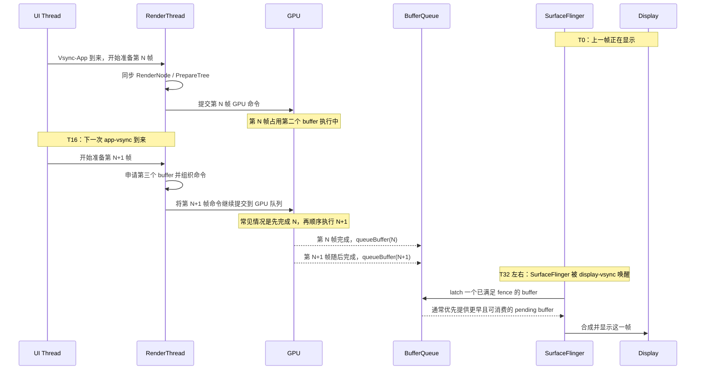

# Android 渲染全链路总结：从 Vsync 到屏幕像素

这份文档不是为了堆概念，而是为了回答 4 个真正决定你是否“学透”的问题：

1. 一帧到底是被谁在什么时候启动的。
2. UI 线程、RenderThread、GPU、SurfaceFlinger 各自负责什么。
3. 一帧“渲染完成”为什么不等于“一帧已经上屏”。
4. Triple Buffer 到底缓解了什么，又没有解决什么。

如果你复习时始终围绕这 4 个问题去看，很多名词会自动串起来。

---

## 总主线：一帧是怎么跑完全程的

可以先记住这条最短主线：

`Vsync-App -> UI 线程遍历/录制 -> RenderThread 同步并提交 GPU -> BufferQueue 排队 -> SurfaceFlinger latch -> 合成 -> Display 在下一个显示周期呈现`

其中最容易混淆的 3 个边界是：

- UI 线程负责的是“生成绘制描述”，不是直接把像素画到屏幕。
- GPU 负责的是“把某个 buffer 画好”，不是决定它何时显示。
- SurfaceFlinger 负责的是“在显示节拍上选择并合成 buffer”，不是替应用生成绘制命令。

---

## 第一阶段：节拍器与触发源 (Vsync)

所有渲染动作都始于 Vsync，但 Android 实际上关心两类节拍：

- `Vsync-App`
  作用：唤醒应用，让 UI 线程开始这一帧的逻辑、测量、布局、录制。
- `Vsync-SF`
  作用：唤醒 `SurfaceFlinger`，让它在这一轮显示周期中决定 latch 哪些 layer 的 buffer 并进行合成。

为什么会有 phase offset：

- 如果 App 和 SF 完全同拍启动，SF 很可能在合成时还拿不到应用刚生产出来的新 buffer。
- 把 `Vsync-SF` 适当后移，可以给应用留出一段“生产窗口”。
- 如果应用在这段窗口内完成了录制、RenderThread 同步、GPU 关键路径，SF 就有机会在同一个显示周期内拿到更新后的内容。

触发入口：

- `ViewRootImpl` 通过 `Choreographer` 接收 app-vsync，并在回调中触发 `performTraversals()`。

这一阶段的关键理解：

- Vsync 不是“立刻上屏”的信号，而是“开始准备这一帧”的系统节拍。

---

## 第二阶段：窗口与生产者契约 (Surface / SurfaceControl / BLAST)

应用想把内容送上屏幕，必须先拥有一个被系统认可的输出目标，这就是 `Surface` 背后的那套生产者-消费者契约。

关键点：

- `Surface` 可以理解为应用拿到的 BufferQueue producer 句柄。
- `SurfaceControl` 是这个可组合图层在系统中的控制对象。
- 在 Android 11+ 中，BLAST 让 buffer 提交和窗口属性变更一起进入原子事务，减少“buffer 对了但位置还没对”的不同步问题。

为什么这层重要：

- 如果不先理解 `Surface` 是 producer 句柄，后面 `dequeueBuffer / queueBuffer / fence / latch` 都会变成空名词。
- 应用并不是“直接画屏幕”，而是“向 BufferQueue 生产 buffer，让系统在合适时机消费”。

零拷贝的本质：

- 真正跨进程移动的不是像素本体，而是共享内存句柄，例如基于 Gralloc/DMA-BUF 的 FD。

---

## 第三阶段：UI 线程录制绘制意图 (RenderNode / RecordingCanvas)

这一阶段最容易被误解。UI 线程通常并不是在“真正做 GPU 绘制”，而是在录制一份可复用的绘制描述。

角色分工：

- `HardwareRenderer` / `ThreadedRenderer`
  Java 层的渲染代理，把“我要画什么”传给 Native 渲染体系。
- `RenderNode`
  每个 View 在硬件加速体系里的核心承载对象，保存属性与 display list。
- `RecordingCanvas`
  不是立刻出像素，而是把绘制调用录成指令。

为什么脏区优化能成立：

- 只有脏的 View 才需要重新录制 display list。
- 没变的 RenderNode 可以直接复用。
- 所以 View 系统的高效之处，本质上是“记录绘制意图并做增量重用”，不是每帧从零开始画整棵树。

这一阶段的关键理解：

- `draw()` 在硬件加速场景下，更接近“录制命令”而不是“立刻刷屏”。

---

## 第四阶段：RenderThread 同步、GPU 提交与 BufferQueue

图纸录好后，真正推动一帧进入 GPU 管线的是 `RenderThread`。

核心职责：

- 调用类似 `CanvasContext::prepareTree` 的路径，把 UI 线程暂存的 staging 数据同步进原生渲染树。
- 组织本帧真正的 GPU 提交。
- 通过 `ANativeWindow` 与 BufferQueue 协作，执行 `dequeueBuffer / queueBuffer`。

这里要分清两件事：

- “提交了 GPU 命令”
- “这个 buffer 已经能被 SurfaceFlinger 安全消费”

它们中间隔着 fence：

- GPU 还在画时，buffer 虽然可能已经 queue 进 BufferQueue，但会附带同步 fence。
- SurfaceFlinger 只有在 fence 满足后，才会把该 buffer 视为真正可用。

这一阶段的关键理解：

- RenderThread 是把录制结果转成 GPU 工作的桥。
- GPU 渲染完成，只代表某个 buffer 画好了，不代表它已经上屏。

---

## 第五阶段：Triple Buffer 到底缓解了什么

Triple Buffer 的核心价值不是“让 GPU 同时并行渲染三帧”，而是减少生产者因为 buffer 不够而被迫停工。

如果只有双缓冲：

- 一个 buffer 可能正被显示系统持有。
- 一个 buffer 可能正被 GPU 渲染。
- 这时应用侧再想开始下一帧，`dequeueBuffer` 很可能阻塞。

引入第三个 buffer 后：

- 即使一块在显示，一块在 GPU 中，应用侧也仍有机会先拿到第三块 buffer，继续向前准备一帧。
- 这样能把“GPU 一次轻微超时”从“整条链路都停住”变成“应用还能勉强维持生产”。

但 Triple Buffer 没解决的问题：

- 它不能凭空提升 GPU 吞吐。
- 如果 GPU 长期跟不上刷新率，队列里只会积压更多延迟。
- Triple Buffer 缓解的是 producer starvation，不是永久消除 jank。

### Triple Buffer 时序图

下面这个时序图描述的是一种典型场景：第 `N` 帧正在 GPU 上执行，第 `N+1` 帧已经在第三个 buffer 上开始准备。

这个图要记住两点：

- RenderThread 可以在 GPU 还没画完 `N` 时，继续为 `N+1` 组织并提交命令。
- `N+1` 能否立刻显示，不由 RenderThread 决定，而由 BufferQueue 就绪状态和 SurfaceFlinger 的 latch 时机决定。

---

## 第六阶段：SurfaceFlinger、latch、合成与显示

很多资料讲到 RenderThread 就停了，这就是“隔靴搔痒”的来源之一。因为真正决定用户看到什么的，是 SurfaceFlinger 这一段。

SurfaceFlinger 做的事：

- 在自己的显示节拍上被唤醒。
- 遍历 layer，尝试从各自的 BufferQueue 中 latch 可用 buffer。
- 把所有 layer 交给 HWC 或 GPU 做最终合成。
- 让合成结果在下一个显示时刻出现在屏幕。

这里最容易误解的点：

- `queueBuffer` 不等于立刻显示。
- `GPU 完成` 不等于立刻显示。
- `SurfaceFlinger latch 到了` 也不等于当下这一纳秒就肉眼可见，真正显示还受 display refresh 时序约束。

关于“会不会直接跳过 N 显示 N+1”：

- 存在 frame dropping、队列丢弃、低延迟 latch 等机制，但不能把它简化成“只要队列里有 N 和 N+1，SF 就默认丢 N 显示 N+1”。
- 普通 BufferQueue 路径下，更常见的理解应该是：SF 每次 latch 一个当前满足条件的 buffer，并尽量保持消费时序，而不是天然 newest-wins。

---

## 这份知识为什么容易学得“不透”

如果你总感觉“概念都认识，但心里还是虚”，通常是因为缺了下面这 5 个因果钉子：

1. 没把“录制命令”和“真正 GPU 绘制”分开。
2. 没把“GPU 渲染完成”和“用户已经看到”分开。
3. 没把“BufferQueue 排队”和“SurfaceFlinger 何时 latch”分开。
4. 只记住了 triple buffer 是三个 buffer，却没记住它解决的是哪一种阻塞。
5. 只记组件名，不记每个组件的输入、输出、阻塞点和唤醒条件。

以后复习时，建议每一层都问自己 4 句话：

- 这一层的输入是什么。
- 这一层的输出是什么。
- 这一层什么时候会阻塞。
- 这一层的完成，是否已经等价于“上屏”。

只要这 4 个问题都能答出来，你就不是背概念，而是真的理解了链路。

---

## 一页复习抓手

可以把整条链路压缩成下面这张脑图式口诀：

- App-vsync：启动应用准备一帧。
- UI 线程：遍历 View 树，录制 RenderNode。
- RenderThread：同步树、dequeue buffer、提交 GPU。
- GPU：把某个 buffer 画完，并用 fence 宣告完成。
- BufferQueue：缓存生产者和消费者之间的帧。
- SurfaceFlinger：按显示节拍 latch、合成、提交显示。
- Display：在物理刷新点真正把结果呈现出来。

---

## 源码指路地图

- Java 渲染入口：`HardwareRenderer.java`
- Native 同步点：`CanvasContext.cpp::prepareTree`
- 指令存储容器：`RenderNode.cpp`
- 指令录制器：`SkiaRecordingCanvas.cpp`
- Buffer 与事务协议：`libs/gui/LayerState.h`
- SurfaceFlinger 主体：`frameworks/native/services/surfaceflinger`
