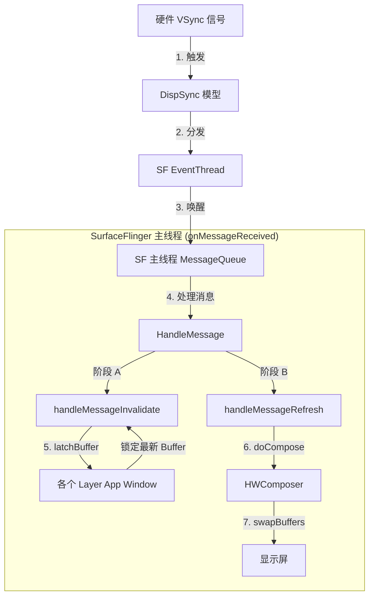

# SurfaceFlinger 核心机制全解：启动与绘制闭环

SurfaceFlinger 是 Android 图形系统的“心脏”。要理解它，我们不能只见树木不见森林。本文将为你梳理其**启动流程**和**核心绘制循环**。

---

## 1. 启动流程 (The Startup Sequence)

SurfaceFlinger 是一个 Native 系统服务，它在 Android 启动早期（`init.rc` 阶段）就被拉起来了。

### 关键步骤如下：

1.  **构造 (Construction)**:
    *   创建 `SurfaceFlinger` 对象。
    *   **关键动作**: 创建 `DispSync` (节拍器)、`EventControlThread` (开关员)、`EventThread` (传令兵)。
    *   *此时它就像一个刚组建好的乐团，乐器都买好了，但在后台候场。*

2.  **初始化 (init)**:
    *   初始化 EGL (OpenGL 环境) 和 `HWComposer` (硬件合成器)。
    *   **关键动作**: 获取屏幕信息 (Primary Display)，告诉硬件“我要接管屏幕了”。
    *   初始化绘图表面 (RenderEngine)。

3.  **运行 (run)**:
    *   这是最关键的一步。它会调用 `waitForEvent()` 进入**死循环**。
    *   **从此，SurfaceFlinger 的生命就变成了无尽的等待和处理消息。**

---

## 2. 核心绘制机制 (The Rendering Loop)

SurfaceFlinger 的工作不是持续不断的，而是**由 VSync 驱动的**。这是一个标准的 **基于事件 (Event-Driven)** 的模型。

### 核心循环图解

### 详细步骤解析

#### 阶段 0: 等待 (Idle)
SurfaceFlinger 在 `MessageQueue.waitMessage()` 处睡眠。如果没有屏幕更新请求，它会一直睡下去（省电）。

#### 阶段 1: 唤醒 (Wake Up)
当有 App 更新了界面（`queueBuffer`），它会请求下一次 VSync。
当 VSync 到来时，`EventThread` 发送此时刻的信号给 SurfaceFlinger 的主线程。

#### 阶段 2: 处理事务 (handleMessageTransaction)
*   **作用**: 处理“非图像”的变更。
*   比如：窗口位置移动了、窗口大小变了、新建了一个窗口、改变了 Z-order。
*   这些操作不涉及像素，只涉及**图层属性**。SF 会在这里更新所有图层的状态。

#### 阶段 3: 处理失效 (handleMessageInvalidate) —— **"Latch Buffer"**
*   **关键动作**: **Latch (门闩/锁定)**。
*   **解释**: 这是一个非常关键的概念。
    *   App 可能在 16ms 内画了好几帧（比如游戏跑得飞快），BufferQueue 里堆积了 3 个 Buffer。
    *   SurfaceFlinger 在这一步，会从每个图层的 BufferQueue 里**拿走最新且符合时间的一个 Buffer**。
    *   就像给当前这一帧画面“拍个照”，锁定住。再有新的 Buffer 进来，只能等下一帧了。

#### 阶段 4: 处理刷新 (handleMessageRefresh) —— **"Composite"**
这是真正“画”或者是“拼”的一步。它包含三个子步骤：

1.  **preComposition**:以此告诉各个 Layer：“我们要开始合成了，你们准备一下”。
2.  **doComposition (最核心)**:
    *   **询问 HWC**: "嘿，硬件大哥，这些图层（Layer A, B, C）你能直接处理吗？"
    *   **HWC 回答**: "A和C我能处理（Overlay），B 不行（Client Composition），你用 GPU 画好给我。"
    *   **SF 执行**: 
        *   对于 HWC 能处理的，直接把 Buffer 句柄给它。
        *   对于 HWC 不能处理的，SF 调用 OpenGL (RenderEngine) 把它们画到一个 Framebuffer 上，然后把这个 Framebuffer 给 HWC。
3.  **postComposition**: 清理工作，释放这一帧用完的旧 Buffer。

---

## 3. 为什么这个机制如此重要？(First Principles)

1.  **原子性 (Atomicity)**:
    *   通过 `Latch Buffer` 机制，保证了屏幕上显示的所有窗口（状态栏、应用、弹窗）在**同一时刻**更新。绝不会出现“状态栏是下一秒的，而应用内容还是上一秒的”这种撕裂感。

2.  **流水线效率 (Pipelining)**:
    *   App 在生产 Buffer，SF 在消费 Buffer。
    *   VSync 对齐让两者井井有条，互不等待（理想情况下）。

3.  **硬件加速**:
    *   极其依赖 `HWComposer`。只有在迫不得已时（比如复杂混合模式、圆角不支持），SF 才会亲自用 GPU 去合成。绝大多数时候，它只是在**指挥**硬件搬运数据。
